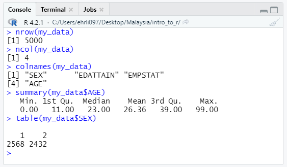

layout: true

background-image: url(images/ipums-banner.png)
background-position: 40% 98%
background-size: 140%

<style>
.remark-slide-number {
  font-size: 20pt;
  margin-bottom: 30px;
  margin-right: 10px;
  color: #000000; /* black */
  opacity: 0.0; /* default: 0.5 */
}
</style>


```{r setup, include=FALSE}


options(htmltools.dir.version = FALSE)
knitr::opts_chunk$set(
  echo = TRUE, 
  collapse = TRUE
)
```

<style>
  .greyed-out {
    color: #D3D3D3;
  }
</style>


---
# Overview 0

Introduction
  What is R
  Why use R
  Key Terms


--
Getting Started
  Installation
  Rstudio Navigation (Live Demo)
  Coding in R/Rstudio (Live Demo)


--
Common Applications
  Read in data
  Manipulate Data
  Visualize Data
  
--
Reporting in R
  Scripts vs Rmd

--
Q&A
  Ask in Chat?
  Pass to Moderator for End?


--  
Resources


---
# Overview 1


.greyed-out[]

Introduction
  What is R
  Why use R
  Key Terms


Getting Started
  Installation
  Rstudio Navigation (Live Demo)
  Coding in R/Rstudio (Live Demo)


Common Applications
  Read in data
  Manipulate Data
  Visualize Data
  
  
Reporting in R
  Scripts vs Rmd


Q&A


Resources

---
# 1. Introduction


---

class: center

# What is R?

--

.pull-left[
### Statistical Software Package
```{r echo = FALSE, out.width = "50%", fig.align = "center"}
knitr::include_graphics("images/stata-logo.png")
```

```{r echo = FALSE, out.width = "40%", fig.align = "center"}

```

```{r echo = FALSE, out.width = "40%", fig.align = "center"}
knitr::include_graphics("images/sas-logo.png")
```

]

--

.pull-right[
### Programming Language

```{r echo = FALSE, out.width = "40%", fig.align = "center"}
knitr::include_graphics("images/python-logo.png")
```

]

???
Like statistical software packages, such as Stata, SPSS, and SAS, R has built-in
functionality for statistical analysis.

Like programming languages, such as Python, R is designed to facilitate the 
creation of user-contributed functions and packages to perform a variety of 
computing tasks, including data management, exploration, analysis, and 
reporting.

---

class: center

# What is R?


### Statistical Software Package + Programming Language

```{r echo = FALSE, out.width = "60%", fig.align = "center"}
knitr::include_graphics("images/r-logo.svg")
```


???
In other words, R combines the statistical capabilities of a stats package with 
the flexibility of a more general purpose programming language.

One example of R's flexibility: The slides we're looking at right now were
created using R!

---

# Point-and-click vs. Code  

```{r echo = FALSE, out.width = "100%"}
knitr::include_graphics("images/stata-menu-interface.gif")
```

???
Because R is a stats package *and* a programming language, the experience of 
learning R is a bit different from other stats packages.

Whereas some other stats packages like Stata and SPSS offer a point-and-click 
menu interface for common operations...


---

# Point-and-click vs. Code

```{r echo = FALSE, out.width = "80%", fig.align = "center"}
knitr::include_graphics("images/r-table-screen-recording.gif")
```


???
Learning R typically involves learning to write R code from the very beginning. 

This contributes to a slightly steeper initial learning curve for R compared to 
other stats packages, but the medium- and long-term benefits of managing and 
analyzing your data with code far outweigh this short term cost.


---

# Why use R?

--

* Flexibility

--

* Cutting-edge and trustworthy statistical methods

--

* Open source

--

* Large, active, friendly user community

--

* Free!


???
That leads us right into our next question: Why do we think you should use R?

First, because R is a fully-realized programming language, it provides 
flexibility to complete a variety of tasks, including but not limited to data 
management, analysis, visualization, and reporting. Thus, the initial 
investment in learning R has a big payoff in potential use cases.

Secondly, R is the language of choice for most academic statisticians, so new 
statistical techniques are often available in R before they come to other stats 
packages. For example, and particularly relevant in the context of census data, 
many leading researchers in statistical disclosure control create R packages to 
implement their techniques.

Because of this close connection with academic statistics, you can also trust 
the soundness of the statistical techniques implemented in R. Often, researchers 
will publish descriptions of new packages in the peer-reviewed Journal of 
Statistical Software. 

Moreover, both R and contributed R packages are open source, and most functions
in R are written in ordinary R code, so the community of R users can review the
implementation of particular techniques, fix bugs and errors, or adapt code for 
new purposes.

Speaking of the community, R has a large, active, and friendly user community 
that is constantly working to improve R and creating resources for learning R.

Finally, in contrast to most other stats packages, R is free!

---
# Key Terms - **Functions**, Objects, Packages

To read data into R, we can use the `read.csv()` **function**.
* **Functions** end in parentheses
* **Functions** take various **arguments** within their parentheses as **input**.
* **Functions** perform actions/operations on the inputs and usually return **output**.
--


The `read.csv()` **function** takes the `file=`  **argument** as **input**. Below, we *pass* the filepath `"example_data.csv"`as the **argument** to the **function** 

.pull-left[
User Input:
```{r, eval = FALSE}

read.csv(file="example_data.csv")
```
]

.pull-right[
R output:
```{r, echo=FALSE}
read.csv("example_data.csv")
knitr::include_graphics("images/print_csv_1.png")
```


`...`


```{r}

```
]

 

???

Here we can (probably) see our data has been read in and printed...probably not what most users want/need.

---


# Key Terms


Functions, **Objects**, Packages


Technically the **output** of `read.csv()` is a `data.frame`
  + `data.frame`s are like spreadsheets, with data organized into rows and columns.
  
Instead of printing the contents of `"example_data.csv"`, we want save that information to an **R object**. 

**R objects** are variables, data, (even functions) stored in R's local memory so the user can interact with them. 

To create an **R object**, use the `<-` command to **assign** the contents of `"example_data.csv"` to an **R object** called `my_data`. 
  + `<-` is called the **assignment operator** and can be read as "gets" or "gets the result of"
  + The below code could be read as: *"my_data gets the result of read.csv"

---


# Key Terms


Functions, **Objects**, Packages

Now that `my_data` is stored as an **R object**, we can use **functions** to interact with it.
  * To type the assignment operator, use `[less than]``[minus sign]`
  * In some cases, like when only one argument is needed, the argument name does not need to be specified


.pull-left[

User Input:
```{r, eval = FALSE}

my_data <- read.csv(file = "example_data.csv")
View(my_data)
```

]

.pull-right[

R output:
```{r, echo= FALSE}
my_data <- read.csv("example_data.csv")
knitr::include_graphics("images/view_data.png")
```

]


???

"everything in R is an object, everything you do in R is a function" - someone, somewhere, probably

---


# Key Terms

The **output** of `read.csv()` is a `data.frame`.
  + Like a spreadsheet, `data.frames` organize data by rows and columns.

Some functions work `data.tables`, while others are meant for single columns or `vectors`.
  + Specify a column name using `$`

.pull-left[

User Input:
```{r, eval = FALSE}
nrow(my_data)
ncol(my_data)
colnames(my_data)

mean(my_data$AGE)
summary(my_data$AGE)
```

]

.pull-right[

R output:
```{r, echo= FALSE}

```

]


---


# Key Terms


Functions, Objects, **Packages**

**Packages** are bundles of In R, collections of **functions** can be bundled into **package**.

**base R** refers to the "starter set" of packages users get when they "download R".

  + Using **base R** users *could* write code to accomplish *nearly* anything they want to
--
  + Takes time and effort to code
  + *Can't someone else do it??*

---

Functions, Objects, **Packages**

The **C**omprehensive **R** **A**rchive **N**etwork (CRAN) hosts > 18k Contributed Packages that expand the capabilities of R.
  + Add support for specific/obscure programs or file types
  + Streamline common tasks, data wrangling/visualization
  + Bundle complex analysis/operations into simple, user friendly functions

--

**Don't be intimidated!**

* Packages provide high level of *customization*, allowing the user to fine-tune thier R experience
* Data management, Analysis, Visualization, Reporting all in one program
* See [Resource List]() for our recommendations of common/helpful R packages for working with census/survey data. 


???

3 main "avenues" for packages

While openxlsx is geared towards interacting with a specific filetype, other packages streamline common operations or execute specific analysis - all serve to expand the functioanlit of R

---

# Key Terms

Functions, Objects, **Packages**

While base R does not have support to read .xlsx files, `openxlsx` provides read/write support.

```{r, eval = FALSE}

install.packages("openxlsx") ## download from CRAN
library(openxlsx) ## load package locally

my_data <- read.xlsx("example_data.xlsx")
write.xlsx(my_data,file =  "example_data.xlsx")

install.packages("haven")
librarry(haven)

my_data <- haven::read_dta(file = "example_data.dta") ## STATA


```


* `install.packages()` needs to be done only once - or periodically to update. 
* `library()` needs to called each time you open R (to access that package)

??

Example of a package that interacts with a specific program

---

Functions, Objects, **Packages**

For interacting with other stats packages (eg, STATA, SPSS, SAS), we reccomend the `haven` package.

.pull-left[
```{r, eval = FALSE}
install.packages("haven")
library(haven)

read_stata()
read_dta()

read_sas()
read_xpt()

read_spss()
read_por()
read_sav()
```
]
.pull-right[
In addition to supporting many filetypes, `haven` supports labeled values
  + More on this in the demo
]

---

# Key Terms

Functions, Objects, **Packages**


.pull-left[
  
```{r, eval = FALSE}

install.packages("gtsummary") ## download from CRAN
install.packages("ggplot2") 

library(gtsummary)  ## load package locally
library(ggplot2)

```
]

.pull-right[

Streamlining common tasks / quality of life packages 
  * `gtsummary` Makes it easy to render informative and polished tables.
  * `ggplot2` Makes data visualization easier. 
  * More on this in the demo
]

???


---

# Key Terms


Functions, Objects, **Packages**

Adding support for complex operations - `ipumsr`

.pull-left[
```{r, eval = FALSE}

install.packages("ipumsr") ## download from CRAN

library(ipumsr) ## load package locally

```

]

.pull-right[
  * Developed in-house functions for working with extensive metadata
    + Took advantage of structured and standardized data
    + DDI standard, plus IPUMS-specific fields
  * Released on CRAN in **2013???** for IPUMS users to benefit
    + **Newly added** API support for the IPUMS microdata extract system.
]


???


---

# Key Terms

Review

* Functions


* Objects


* Packages


---

# Key Terms

Review

* Functions
  + *Do* things in R
  
* Objects


* Packages


---

# Key Terms

Review

* Functions
  + *Do* things in R
  
* Objects
  + *Are* things in R

* Packages

---

# Key Terms

Review

* Functions
  + *Do* things in R
  
* Objects
  + *Are* things in R

* Packages
  + **Contain** things in R


---


# Overview 2

.greyed-out[

Introduction

  What is R
  
  Why use R
  
  Key Terms ]

Getting Started
  
  Installation
  
  Rstudio Navigation (Live Demo)
  
  Coding in R/Rstudio (Live Demo)
.greyed-out[
Common Applications

  Read in data
  
  Manipulate Data
  
  Visualize Data
  
Reporting in R

  Scripts vs Rmd

Q&A

Resources
]

---

# Getting Started
--

How do I get it?!?

???

now that you've learned some fundamentals, we'll go over:
* installation R/Rstudio
* basic setup and navigation.
* Review Key Terms in action

---

# R vs. RStudio

--

.pull-left[
```{r}
knitr::include_graphics("images/r-as-engine.jpg")
```
]


- You need R to use RStudio
- RStudio makes it easier and more fun to use R

???
We recommend installing both R and RStudio. The distinction between these two 
can be confusing at first, but one way to think of it is that R is the engine, 
and RStudio is the fancy sports car powered by the engine.

In other words, you need R to use RStudio, and RStudio makes it easier and more 
fun to use R

Any R users currently - raise hands


---


# Installation - R

https://cran.r-project.org/

```{r, echo = FALSE, fig.alt = "A screenshot of download links on cran.r-project.org"}
knitr::include_graphics("images/r_install_1.png")
```

  
+ https://cran.r-project.orgbin/windows/base/
+ https://cran.r-project.org/bin/macosx/
+ (pre-bundled on linux)


???

Don't go too quickly on this

---

# Installation - Rstudio


https://www.rstudio.com/

```{r, echo = FALSE, fig.alt = "A screenshot of download links on cran.r-project.org"}
knitr::include_graphics("images/rstudio_install2.png")
```

  + https://www.rstudio.com/products/rstudio/download/
  + https://www.rstudio.com/products/rstudio/download-server/


???
  + **NOTE:** Might require admin privileges
  
---

# Demo: Rstudio Navigation


???


- environment setup
- basic "pane" navigation
  + enter basic code in console
    + r as a calculator
    + basic mathematic operators/forumals
    
  + simple built in functions - what is a function
    + mean of vector
    + 1:5 sequence
    + c()
    + vectors vs matrices vs data.frames
      + data.frame ~ dataset
    + built in R datasets
    
    
  + reference this as analagous to a "do-file" in stata and "syntax file" in spss
  + same code
  + creating scripts/processes
- loading packages 
- explain packages
- explain base r vs tidyverse
  + consistent syntax
  + data.frame centric - takes some of the confusion out of using R

---

# Demo: Coding in R/Rstudio

---
# Overview 3

<<<<<<< HEAD
.greyed-out[
=======
# Plotting example

.pull-left[
### Base R
```{r, eval = TRUE, echo = TRUE}

my_data

```
]

.pull-right[
### ggplot
```{r, eval = TRUE, echo = TRUE}

my_data

```
]

---

# Table example

---

# Overview 6


>>>>>>> 123ceaaf63a2b6ea210ff4356e8824515a57165e

Introduction

  What is R
  
  Why use R
  
  Key Terms

Getting Started
  
  Installation
  
  Rstudio Navigation (Live Demo)
  
  Coding in R/Rstudio (Live Demo)]

Common Applications

  Read in data
  
  Manipulate Data
  
  Visualize Data
.greyed-out[  
Reporting in R

  Scripts vs Rmd

Q&A

Resources
]

---

# Overview 4

.greyed-out[

Introduction

  What is R
  
  Why use R
  
  Key Terms

Getting Started
  
  Installation
  
  Rstudio Navigation (Live Demo)
  
  Coding in R/Rstudio (Live Demo)

Common Applications

  Read in data
  
  Manipulate Data
  
  Visualize Data]
  
Reporting in R

  Scripts vs Rmd
.greyed-out[
Q&A

Resources
]

---

# Overview 5

.greyed-out[

Introduction

  What is R
  
  Why use R
  
  Key Terms

Getting Started
  
  Installation
  
  Rstudio Navigation (Live Demo)
  
  Coding in R/Rstudio (Live Demo)

Common Applications

  Read in data
  
  Manipulate Data
  
  Visualize Data]
  
Reporting in R

  Scripts vs Rmd

Q&A
]
Resources

---

# Resources

```{r}
## ipums logo or website banner
# knitr::include_graphics()
```

* link to webpage

---
