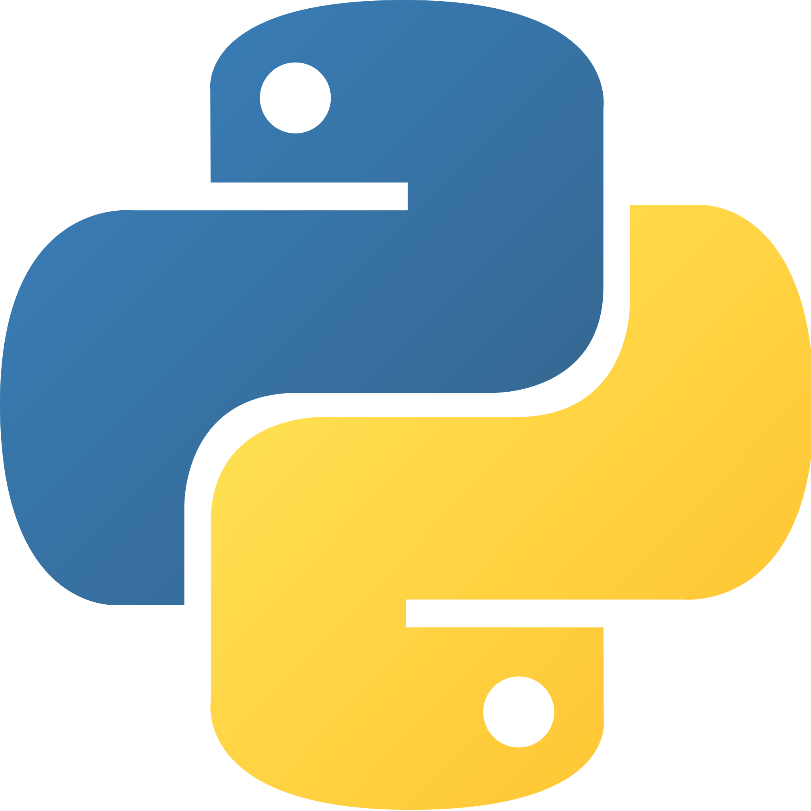
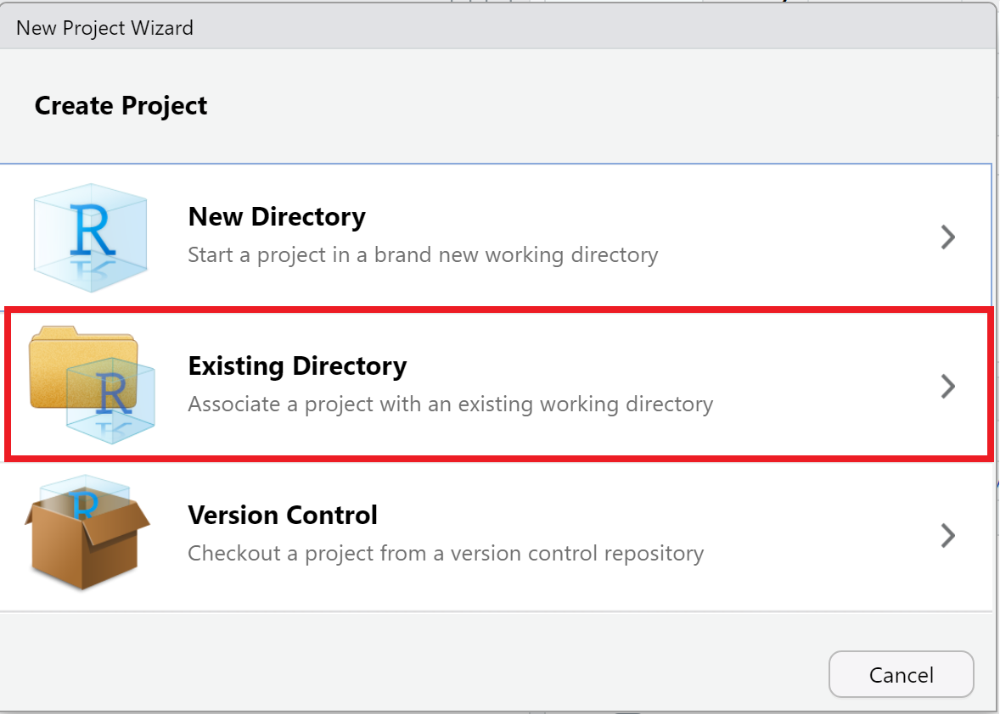
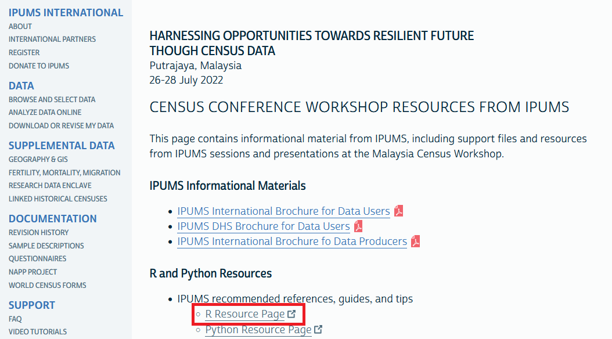

layout: true

background-image: url(images/ipums-banner.png)
background-position: 40% 98%
background-size: 140%

<style>
.remark-slide-number {
  font-size: 20pt;
  margin-bottom: 30px;
  margin-right: 10px;
  color: #000000; /* black */
  opacity: 0.0; /* default: 0.5 */
}
</style>


```{r setup, include=FALSE}

options(htmltools.dir.version = FALSE)
knitr::opts_chunk$set(
  echo = TRUE, 
  collapse = TRUE
)
```

<style>
  .greyed-out {
    color: #D3D3D3;
  }
</style>

<style>
  .tab{
    margin-left: 40px;
    font-size: 16px;
  }

</style>


---

Introduction
.tab[
What is R <br>
Why use R <br>
Key Terms
]

--

Getting Started <br> .tab[
  Installation <br>
  Project Setup <br>
  Rstudio Navigation <br>
  Coding in R/Rstudio (Live Demo)
]
--

R + Packages 
.tab[  
  Tables <br>
  Graphs 
]

--

Reporting in R
.tab[
  Scripts vs Rmarkdown
]

--

Q&A / Resources

???

Feel free to ask questions in chat, 
will address at end 
and point to more resources

---

Introduction <br> .tab[
What is R <br>
Why use R <br>
Key Terms
]


.greyed-out[
Getting Started <br> .tab[
  Installation <br>
  Project Setup <br>
  Rstudio Navigation <br>
  Coding in R/Rstudio (Live Demo)
]


R + Packages 
.tab[  
  Tables <br>
  Graphs 
]


Reusable Code
.tab[
  R Scripts <br>
  R Markdown <br>
  Rmd Reports
]


Q&A / Resources

]

---

# Introduction


---

# Introduction - What is R?

--

.pull-left[
### Statistical Software Package
```{r echo = FALSE, out.width = "50%", fig.align = "center", fig.alt = "Stata logo"}
knitr::include_graphics("images/stata-logo.png")
```

```{r echo = FALSE, out.width = "40%", fig.align = "center", fig.alt = "SPSS logo"}
knitr::include_graphics("images/spss-logo.png")
```

```{r echo = FALSE, out.width = "40%", fig.align = "center", fig.alt = "SAS logo"}
knitr::include_graphics("images/sas-logo.png")
```

]

--

.pull-right[
### Programming Language
```{r echo = FALSE, out.width = "40%", fig.align = "center", fig.alt = "Python logo"}

```

]

???
Like statistical software packages, such as Stata, SPSS, and SAS, R has built-in
functionality for statistical analysis.

Like programming languages, such as Python, R is designed to facilitate the 
creation of user-contributed functions and packages to perform a variety of 
computing tasks, including data management, exploration, analysis, and 
reporting.

---

# Introduction - What is R?


### Statistical Software Package + Programming Language

```{r echo = FALSE, out.width = "60%", fig.align = "center", fig.alt = "R logo"}
knitr::include_graphics("images/r-logo.svg")
```


???
In other words, R combines the statistical capabilities of a stats package with 
the flexibility of a more general purpose programming language.

One example of R's flexibility: The slides we're looking at right now were
created using R!

---

# Point-and-click vs. Code  

```{r echo = FALSE, out.width = "100%", fig.alt = "Brief screen recording of a mouse pointer clicking through the menu interface in Stata"}

```

???
Because R is a stats package *and* a programming language, the experience of 
learning R is a bit different from other stats packages.

Whereas some other stats packages like Stata and SPSS offer a point-and-click 
menu interface for common operations...


---

# Point-and-click vs. Code

```{r echo = FALSE, out.width = "80%", fig.align = "center", fig.alt = "Brief screen recording of typing the command `table(mtcars$cyl, mtcars$gear)` into the RStudio console and printing a crosstabulation of those two variables."}
knitr::include_graphics("images/r-table-screen-recording.gif")
```


???
Learning R typically involves learning to write R code from the very beginning. 

This contributes to a slightly steeper initial learning curve for R compared to 
other stats packages, but the medium- and long-term benefits of managing and 
analyzing your data with code far outweigh this short term cost.


---

# Why use R?

--

* Flexibility

--

* Cutting-edge and trustworthy statistical methods

--

* Open source

--

* Large, active, friendly user community

--

* Free!


???
That leads us right into our next question: Why do we think you should use R?

First, because R is a fully-realized programming language, it provides 
flexibility to complete a variety of tasks, including but not limited to data 
management, analysis, visualization, and reporting. Thus, the initial 
investment in learning R has a big payoff in potential use cases.

Secondly, R is the language of choice for most academic statisticians, so new 
statistical techniques are often available in R before they come to other stats 
packages. For example, and particularly relevant in the context of census data, 
many leading researchers in statistical disclosure control create R packages to 
implement their techniques.

Because of this close connection with academic statistics, you can also trust 
the soundness of the statistical techniques implemented in R. Often, researchers 
will publish descriptions of new packages in the peer-reviewed Journal of 
Statistical Software. 

Moreover, both R and contributed R packages are open source, and most functions
in R are written in ordinary R code, so the community of R users can review the
implementation of particular techniques, fix bugs and errors, or adapt code for 
new purposes.

Speaking of the community, R has a large, active, and friendly user community 
that is constantly working to improve R and creating resources for learning R.

Finally, in contrast to most other stats packages, R is free!

---

# Key Terms

--

Functions
--

Objects
--

Packages

---

# Key Terms - **Functions**, Objects, Packages


### Functions
--

* End in parentheses
--

* Take various **arguments** within their parentheses as **input**.
--

* Perform operations on the **input** and usually return **output**.

---

# Key Terms - **Functions**, Objects, Packages

* Visualize Data
  + `View()`
  + `boxplot()`
  + `barplot()`
--


* Summarize Data
  + `summary()`
  + `table()`
--


* GET the Data
  + `read.csv()`

---

# Key Terms - **Functions**, Objects, Packages


.pull-left[
### User Input:
```{r, echo = FALSE, fig.alt="screenshot of user input to console for read.csv function"}


```
]

--

.pull-right[
### R output:
```{r, echo=FALSE, fig.alt="screenshot of console output for read.csv, first 12 lines"}
knitr::include_graphics("images/print_csv_1.png")
```
`...`
```{r, echo=FALSE, fig.alt="screenshot of console output for last 12 lines of read.csv function"}
knitr::include_graphics("images/print_csv_2.png")
```
]


.pull-left[
* The `read.csv()` **function** takes the `file`  **argument** as **input**. 
* The filepath `"example_data.csv"` is the **argument** to the **function**

]

 

???

Here we can (probably) see our data has been read in and printed...probably not what most users want/need.

---

# Key Terms - Functions, **Objects**, Packages

--

Technically the **output** of `read.csv()` is a `data.frame`
--

  + A `data.frame` is like a spreadsheet
  + Data organized into rows and columns

--

We must **assign** the **output** of `read.csv()` to an **R Object** in order to work with it.

---

# Key Terms - Functions, **Objects**, Packages


```{r, eval = FALSE}
 my_data <- read.csv(file = "example_data.csv")
```

---

# Key Terms - Functions, **Objects**, Packages

```{r, eval=FALSE}
 `my_data` <- read.csv(file = "example_data.csv")
```


**R objects** 
  * Variables, data, or anything else stored in R's local memory, or **environment**,
  * Can be interacted with via **functions**

---

# Key Terms - Functions, **Objects**, Packages
```{r, eval=FALSE}
 my_data `<-` read.csv(file = "example_data.csv")
```

### R objects 
  * Variables, data, or anything else stored in R's local memory, or **environment**,
  * Can be interacted with via **functions**

To create an **R object**, use the **`<-`** command.
--

  * `<-` is called the **assignment operator**
  * Can be thought of as "gets" or "gets the result of"
  * "my_data *gets the result of* read.csv"

---


# Key Terms - Functions, **Objects**, Packages

Now that `my_data` is stored as an **R object**, we can use **functions** to interact with it.
 
.pull-left[
### User Input:
```{r, echo = FALSE, fig.alt="screenshot of r console to read in data from csv"}

```

 * In some cases, like when only one argument is needed, the argument name does not need to be specified
 
]

--

.pull-right[

### R output:
```{r, echo= FALSE, fig.alt="screenshot of the results of View() function. Looks similar to excel.", out.width="75%"}
knitr::include_graphics("images/view_data.png")
```

]


???


---

# Key Terms

Some functions work **`data.frames`**, while others are meant for single columns or **`vectors`**.


--

.pull-left[
### User Input:
```{r, eval = FALSE}
nrow(my_data)
ncol(my_data)
colnames(my_data)

summary(my_data$AGE)
table(my_data$SEX)
```

]


.pull-right[
### R output:
```{r, echo= FALSE}
knitr::include_graphics("images/functions_on_objects.png")
```


]


---

# Key Terms

Some functions work **`data.frames`**, while others are meant for single columns or **`vectors`**.
  + Specify a column name using **`$`**
.pull-left[
### User Input:
```{r, eval = FALSE}
nrow(my_data)
ncol(my_data)
colnames(my_data)

summary(my_data`$`AGE)
table(my_data`$`SEX)
```

]


.pull-right[
### R output:
```{r, echo= FALSE}
knitr::include_graphics("images/functions_on_objects.png")
```

]


---

# Key Terms - Functions, Objects, **Packages**

**Packages** are bundles of custom-built  **functions**.

--

**base R** refers to the "starter set" of packages users get when they "download R".
--

  + Using **base R** users *could* write code to accomplish *nearly* anything they want to
--

  + Takes time and effort to code
--

  + *Can't someone else do it??*


---

# Key Terms - Functions, Objects, **Packages**

The **C**omprehensive **R** **A**rchive **N**etwork (CRAN) hosts > 18k Contributed Packages that expand the capabilities of R.

---

# Key Terms - Functions, Objects, **Packages**

The **C**omprehensive **R** **A**rchive **N**etwork (CRAN) hosts > 18k Contributed Packages that expand the capabilities of R.
  + Add support for specific/obscure programs or file types
  + Streamline common tasks, data wrangling/visualization
  + Bundle complex analysis/operations into simple, user friendly functions

--

**Don't be intimidated!**
--

* Packages provide high level of **customization**, allowing the user to fine-tune their R experience
--

* Data management, Analysis, Visualization, Reporting all in one program!
--

* Plenty of user support - [ipums.org](https://ipums.org)


???


---

# Key Terms - Functions, Objects, **Packages**

--

The most powerful feature of R
--

* Expand support 
* Streamline tasks
* Achieve complex tasks

???

3 main "avenues" for packages

While openxlsx is geared towards interacting with a specific filetype, other packages streamline common operations or execute specific analysis - all serve to expand the functionality of R

---

# Key Terms - Functions, Objects, **Packages**

While **base R** does not have support to read **`.xlsx`** files, the **`openxlsx`** **package** expands base R to provide read/write support.
--

.pull-left[
```{r, eval = FALSE}
## Download from CRAN
install.packages("openxlsx") 
```
]
--
.pull-right[

* `install.packages()` needs to be done only once - or periodically to update. 
* Use one or more `#` to add comments to R code.

]

---

# Key Terms - Functions, Objects, **Packages**

While **base R** does not have support to read `.xlsx` files, the `openxlsx` **package** expands base R to provide read/write support.


.pull-left[
```{r, eval = FALSE}
## Load package locally
library(openxlsx) 

## Read file to Robject
my_data <- read.xlsx(
  "example_data.xlsx")

## Write Robject to file
write.xlsx(my_data,
           "example_data.xlsx")
```
]


.pull-right[

* `install.packages()` needs to be done only once - or periodically to update. 
* Use one or more `#` to add comments to R code.
* `library()` needs to called each time you open R (to access that package)
]


???

---

# Key Terms - Functions, Objects, **Packages**

For interacting with other stats packages (eg, STATA, SPSS, SAS), we recommend the **`haven`** package.

.pull-left[
```{r, eval = FALSE}
install.packages("haven")
library(haven)

read_stata()
read_dta()

read_sas()
read_xpt()

read_spss()
read_por()
read_sav()
```
]
.pull-right[
In addition to supporting many filetypes, `haven` supports labeled values
  + More on this in **`example_script`**
]

---

# Key Terms - Functions, Objects, **Packages**

Streamlining common tasks
.pull-left[
```{r, eval = FALSE}

## download from CRAN
install.packages("gtsummary") 
install.packages("ggplot2") 

## Load package(s) locally
library(gtsummary)  
library(ggplot2)

```
]

.pull-right[
  * `gtsummary` Makes it easy to render informative and polished tables.
  * `ggplot2` Makes data visualization easier. 
  * More on these in Reusable Code
]

???


---

# Key Terms - Functions, Objects, **Packages**

Achieve complex tasks - **`ipumsr`**

.pull-left[
```{r, echo=FALSE, fig.alt="ipumsr logo"}
knitr::include_graphics("images/ipumsr_logo.png") 
```

]

.pull-right[
  * Developed in-house functions for working with IPUMS microdata and metadata
    + Highly structured and standardized data
    + DDI standard, plus IPUMS-specific fields
  * Released on CRAN in 2017
    + Constantly improving

]
  
---

# Key Terms - Functions, Objects, **Packages**

Achieve complex tasks - `ipumsr`

.pull-left[
```{r, echo=FALSE, fig.alt="ipumsr logo"}
knitr::include_graphics("images/ipumsr_logo.png") 
```

]

.pull-right[
  * Developed in-house functions for working with IPUMS microdata and metadata
    + Highly structured and standardized data
    + DDI standard, plus IPUMS-specific fields
  * Released on CRAN in 2017
    + Constantly improving
  * + **Newly added** API support for the IPUMS microdata extract system.
]
  

???

* Because IPUMS takes the time and effort to build highly structured and organized metadata, we are able to take advantage of statistical programming to build complex functions

---

# Key Terms - Review

### Functions


### Objects


### Packages


---

# Key Terms - Review

### Functions
  + *Do* things in R
  
### Objects


### Packages


---

# Key Terms - Review

### Functions
  + *Do* things in R
  
### Objects
  + *Are* things in R

### Packages

---

# Key Terms - Review

### Functions
  + *Do* things in R
  
### Objects
  + *Are* things in R

### Packages
  + *Contain* things in R


---
 
.greyed-out[
Introduction
.tab[
What is R <br>
Why use R <br>
Key Terms
]]


Getting Started <br> .tab[
  Installation <br>
  Rstudio Navigation <br>
  Project Setup <br>
  Coding in R/Rstudio (Live Demo)
]


.greyed-out[
R + Packages 
.tab[  
  Tables <br>
  Graphs 
]


Reusable Code
.tab[
  R Scripts <br>
  R Markdown <br>
  Rmd Reports
]

Q&A / Resources

]

---

# Getting Started - Installation


---

# Getting Started - Installation: R
https://cran.r-project.org/
--
```{r, echo = FALSE, fig.alt = "A screenshot of download links on cran.r-project.org"}
knitr::include_graphics("images/r_install_1.png")
```

  


???

+ https://cran.r-project.orgbin/windows/base/
+ https://cran.r-project.org/bin/macosx/
+ (pre-bundled on linux)

Don't go too quickly on this

---

# Getting Started - Installation: Rstudio
https://www.rstudio.com/
--

```{r, echo = FALSE, fig.alt = "A screenshot of download links on cran.r-project.org"}
knitr::include_graphics("images/rstudio_install2.png")
```


???
  + https://www.rstudio.com/products/rstudio/download/
  + https://www.rstudio.com/products/rstudio/download-server/
  + **NOTE:** Might require admin privileges
  
---

class: center

# R vs. RStudio

--

.pull-left[
## R
```{r echo = FALSE, fig.alt = "Image of a car engine"}

```
]

.pull-right[
## RStudio
```{r echo = FALSE, fig.alt = "Image of a blue sports car"}
knitr::include_graphics("images/rstudio-as-sports-car.webp")
```
]

--

.pull-left[You need R to use RStudio]

--

.pull-right[RStudio makes it easier and more fun to use R]

???
We recommend installing both R and RStudio. The distinction between these two 
can be confusing at first, but one way to think of it is that R is the engine, 
and RStudio is the fancy sports car powered by the engine.

In other words, you need R to use RStudio, and RStudio makes it easier and more 
fun to use R

Any R users currently - raise hands


  
---

# Getting Started - RStudio Navigation

--

```{r, echo=FALSE}
knitr::include_graphics("images/panes_1.png")
```

---

# Getting Started - Rstudio Navigation
### Console
```{r, echo=FALSE}

```
???
  console = R in its simplest form
  all input, most output
---

# Getting Started - Rstudio Navigation
### Environment
```{r, echo=FALSE}
knitr::include_graphics("images/panes_3.png")
```

???
R objects will be shown here
Other tabs not very needed for most users

---

# Getting Started - Rstudio Navigation
### Everything Else
```{r, echo=FALSE}

```

???

As you can see, there are quite a few tabs here. These ones you can expect to usr frequently - more soon.
Freedom to re-arrange and customize

---

# Getting Started - Project Setup 

--

"Projects" are not unique to R, but **Rprojects** are!
--

### R projects
--

  + A folder for all your work
  + A `.Rproj` file with the same name as the folder
  + Self contained (ideally)

    
---

# Getting Started - Project Setup

```{r, fig.alt = "first step of setup: click 'file' then 'new project'", echo=FALSE, out.width="90%"}

```

---

# Getting Started - Project Setup

```{r, fig.alt = "second step of setup: choose new or existing directory, or GIT", echo = FALSE, out.width="75%"}
knitr::include_graphics("images/new_proj_2.png")
```

---

# Getting Started - Project Setup

```{r, fig.alt = "same picture highlighting first option, 'new directory'", echo = FALSE, out.width="75%"}
knitr::include_graphics("images/new_proj_2a.png")
```

---

# Getting Started - Project Setup

```{r, fig.alt = "same picture highlighting second option, 'existing directory'", echo = FALSE, out.width="75%"}

```

---

# Getting Started - Project Setup

```{r, fig.alt = "same picture highlighting third option, 'version control / git'", echo = FALSE, out.width="75%"}

```

---

# Getting Started - Project Setup

```{r, fig.alt = "next step, choose 'New Project' ", echo = FALSE, out.width="75%"}

```

---

# Getting Started - Project Setup

```{r, fig.alt = "last step, name the project", echo=FALSE, out.width="75%"}
knitr::include_graphics("images/new_proj_4.png")
```

---

# Getting Started - Project Setup

```{r, fig.alt = "screenshot of rstudio showing project working drive and .Rproj file", echo=FALSE}

```

---

# Getting Started - Coding in R/Rstudio

```{r, echo = FALSE}
library(haven)
my_data <- read_dta("example_data.dta")

my_data$SEX <- as_factor(my_data$SEX)
my_data$EDATTAIN <- as_factor(my_data$EDATTAIN)
my_data$EMPSTAT <- as_factor(my_data$EMPSTAT)

sub_data <- subset(my_data,
                   EDATTAIN != "Unknown"
                   )

sub_data <- droplevels(sub_data) ## drop removed labels


crosstab <- table(sub_data$EDATTAIN, sub_data$SEX)

```

???


  + reference this as analagous to a "do-file" in stata and "syntax file" in spss
  + same code
  + creating scripts/processes
- loading packages 
- explain packages
- explain base r vs tidyverse
  + consistent syntax
  + data.frame centric - takes some of the confusion out of using R


+ enter basic code in console
  + r as a calculator
  + basic mathematic operators/forumals
    

---

.greyed-out[
Introduction
.tab[
What is R <br>
Why use R <br>
Key Terms
]


Getting Started
.tab[
  Installation <br>
  Project Setup <br>
  Rstudio Navigation <br>
  Coding in R/Rstudio (Live Demo)
]
]

R + Packages 
.tab[  
  Tables <br>
  Graphs 
]

.greyed-out[
Reusable Code
.tab[
  R Scripts <br>
  R Markdown <br>
  Rmd Reports
]


Q&A / Resources

]

---

# R + Packages: Tables 

--

.pull-left[
### Base R
```{r, echo = FALSE, fig.alt = "Screenshot of two lines of code to create a table of proportions, starting with previously created crosstab object, and passing it to the prop.table() and round() functions. The table is then printed by calling the object name ('ppn_tab')."}

```
]

--

.pull-right[
### gtsummary
```{r, echo = FALSE, fig.alt = "Screenshot of code tbl_summary(sub_data, by = 'SEX')"}
knitr::include_graphics("images/ppn-tab-gtsummary-code.png")
```

```{r, echo = FALSE, fig.alt = "Screenshot of HTML table of EDATTAIN frequencies and percentage distribution by SEX, produced by the preceding tbl_summary function call."}

```

]

---

# R + Packages: Graphs 
.pull-left[
### Base R
```{r, echo = FALSE, out.width = "90%"}

```

]

--

.pull-right[
### ggplot2
```{r, echo = FALSE, out.width = "50%"}
knitr::include_graphics("images/barplot-ggplot2-code.png")
```

]

---

# R + Packages: Graphs 
.pull-left[
### Base R
```{r, echo = FALSE}

layout(matrix(c(1,1,2,2), 
              ncol = 4))

barplot(crosstab,
        col = rainbow(4),
        main = "Education by Sex"
)

plot(1, type = "n", bty = "n", 
     xaxt = "n", xlab = "", 
     yaxt = "n",ylab =""
)

legend("center", title = "Ed Attainment",
       legend = levels(sub_data$EDATTAIN),
       pch = 22, pt.bg = rainbow(4),
       inset = c(-1,0)
)
```

]

.pull-right[
### ggplot2
```{r, echo = FALSE}
library(ggplot2)
qplot(x = SEX, fill = EDATTAIN, data = sub_data, geom = "bar")
```
]


--- 
 
.greyed-out[
Introduction
.tab[
What is R <br>
Why use R <br>
Key Terms
]


Getting Started
.tab[
  Installation <br>
  Project Setup <br>
  Rstudio Navigation <br>
  Coding in R/Rstudio (Live Demo)
]


R + Packages 
.tab[  
  Tables <br>
  Graphs 
]]


Reusable Code
.tab[
  R Scripts <br>
  R Markdown <br>
  Rmd Reports
]

.greyed-out[
Q&A / Resources
]


---

# Reusable Code: R Scripts

```{r, echo = FALSE, fig.alt="screenshot of example script, code and comments are hard to differentiate"}


```

???
One of the benefits of doing your data cleaning and analysis using code is 
that you can document what you did, and you can reuse and adapt your code for 
future work.

One way to save your code to make it reusable is to put it in what we call an 
R "script", which is just a plain text file with a ".R" file extension.

R scripts are great for data cleaning and other tasks where you're not focused 
on communicating your results, but they do have some limitations. First, you 
can only provide context and explanation of your code through the use of 
comments, which are the green lines we see here that start with one or more 
hashtag symbols, and there is no support for formatted text such as bold or 
italics. Second, running an R script does not by default create a save-able 
output file that weaves together your code, explanatory text, and output 
objects, such as tables and graphs. Thus, if you wanted to create a report from 
an R script, you might end up saving tables and graphs out to their own files, 
then copying and pasting those into something like a Microsoft Word document. 
That's where R Markdown documents come in.


---

# Reusable Code + Reporting: R Markdown

```{r, echo = FALSE, fig.alt="screenshot of r markdown file, code is more distinct, more formatting apparent", out.width = "95%"}


```

???
R Markdown documents, such as the one shown in the screenshot here, are also 
just plain text files, but with a .Rmd file extension instead of .R. However, 
R Markdown documents use a special syntax that allows you to weave together
formatted explanatory text and code chunks, and most importantly, R Markdown 
documents can be rendered to produce HTML, PDF, or Microsoft Word reports that 
included formatted text, R code, and code output, including tables and graphs.

---

# Reusable Code: R Script vs. R Markdown

.pull-left[
```{r, echo = FALSE, fig.alt="screenshot of example script, code and comments are hard to differentiate" }


```

]
.pull-right[
```{r, echo = FALSE, fig.alt="screenshot of r markdown file, code is more distinct, more formatting apparent"}


```
]

???
So, as I said, both R scripts and R Markdown documents are a great way to save 
your code to document it and make it reusable, and both are ultimately just
plain text files, as we see here with the R script on the left and the R 
Markdown document on the right. Using R Markdown requires learning a little bit 
of additional syntax, but there is a lot of documentation out there to help you 
learn it, and the payoff...


---

# Reusable Code: R Markdown Report


```{r, echo = FALSE, fig.alt="screenshot of rendered html report showing table of contents, headings, and stylized code/plain text narration", out.width = "80%", fig.align='center'}

```

???
Is that you can create beautiful, reproducible reports like the HTML report we 
see here. Here we see a hyperlinked table of contents to navigate our document, 
a formatted heading and explanatory text, an R code chunk, and the graph 
produced by that R code. 

If we had created this report by pasting tables and graphs into Microsoft Word,
and then we realized we wanted to make a change, we would have to rerun our code
and manually copy and paste the results back into our document. With R Markdown,
making a change to the report is as easy as changing your code and clicking a
button to re-render the report.


---

.greyed-out[
Introduction
.tab[
What is R <br>
Why use R <br>
Key Terms
]


Getting Started
.tab[
  Installation <br>
  Project Setup <br>
  Rstudio Navigation <br>
  Coding in R/Rstudio (Live Demo)
]


R + Packages 
.tab[  
  Tables <br>
  Graphs 
]]


Reusable Code
.tab[
  R Scripts <br>
  R Markdown <br>
  Rmd Reports
]]

Q&A / Resources


---

class: center

# Resources for Learning R

Visit the [IPUMS Workshop Resources page](https://international.ipums.org/international/census_workshop_malaysia_2022.shtml)

```{r echo = FALSE}

```

---


