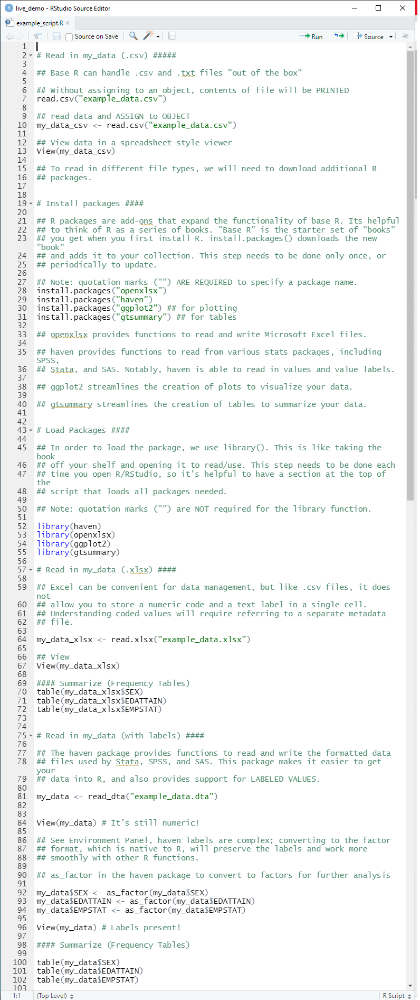

layout: true

background-image: url(images/ipums-banner.png)
background-position: 40% 98%
background-size: 140%

<style>
.remark-slide-number {
  font-size: 20pt;
  margin-bottom: 30px;
  margin-right: 10px;
  color: #000000; /* black */
  opacity: 0.0; /* default: 0.5 */
}
</style>


```{r setup, include=FALSE}

options(htmltools.dir.version = FALSE)
knitr::opts_chunk$set(
  echo = TRUE, 
  collapse = TRUE
)
```

<style>
  .greyed-out {
    color: #D3D3D3;
  }
</style>


---
# Overview 0

Introduction
  What is R
  Why use R
  Key Terms


--
Getting Started
  Installation
  Rstudio Navigation (Live Demo)
  Coding in R/Rstudio (Live Demo)


--
R + Packages 
  Tables
  Graphs 
  
--
Reporting in R
  Scripts vs Rmd

--
Q&A
  Ask in Chat?
  Pass to Moderator for End?


--  
Resources

???

Feel free to ask questions in chat, 
will address at end 
and point to more resources

---
# Overview 1


.greyed-out[]

Introduction
  What is R
  Why use R
  Key Terms


Getting Started
  Installation
  Rstudio Navigation (Live Demo)
  Coding in R/Rstudio (Live Demo)


R + Packages 
  Tables
  Graphs 
  
  
Reporting in R
  Scripts vs Rmd


Q&A


Resources

---
# 1. Introduction


---

class: center

# What is R?

--

.pull-left[
### Statistical Software Package
```{r echo = FALSE, out.width = "50%", fig.align = "center", fig.alt = "Stata logo"}
knitr::include_graphics("images/stata-logo.png")
```

```{r echo = FALSE, out.width = "40%", fig.align = "center", fig.alt = "SPSS logo"}
knitr::include_graphics("images/spss-logo.png")
```

```{r echo = FALSE, out.width = "40%", fig.align = "center", fig.alt = "SAS logo"}
knitr::include_graphics("images/sas-logo.png")
```

]

--

.pull-right[
### Programming Language

```{r echo = FALSE, out.width = "40%", fig.align = "center", fig.alt = "Python logo"}
knitr::include_graphics("images/python-logo.png")
```

]

???
Like statistical software packages, such as Stata, SPSS, and SAS, R has built-in
functionality for statistical analysis.

Like programming languages, such as Python, R is designed to facilitate the 
creation of user-contributed functions and packages to perform a variety of 
computing tasks, including data management, exploration, analysis, and 
reporting.

---

class: center

# What is R?


### Statistical Software Package + Programming Language

```{r echo = FALSE, out.width = "60%", fig.align = "center", fig.alt = "R logo"}
knitr::include_graphics("images/r-logo.svg")
```


???
In other words, R combines the statistical capabilities of a stats package with 
the flexibility of a more general purpose programming language.

One example of R's flexibility: The slides we're looking at right now were
created using R!

---

# Point-and-click vs. Code  

```{r echo = FALSE, out.width = "100%", fig.alt = "Brief screen recording of a mouse pointer clicking through the menu interface in Stata"}
knitr::include_graphics("images/stata-menu-interface.gif")
```

???
Because R is a stats package *and* a programming language, the experience of 
learning R is a bit different from other stats packages.

Whereas some other stats packages like Stata and SPSS offer a point-and-click 
menu interface for common operations...


---

# Point-and-click vs. Code

```{r echo = FALSE, out.width = "80%", fig.align = "center", fig.alt = "Brief screen recording of typing the command `table(mtcars$cyl, mtcars$gear)` into the RStudio console and printing a crosstabulation of those two variables."}
knitr::include_graphics("images/r-table-screen-recording.gif")
```


???
Learning R typically involves learning to write R code from the very beginning. 

This contributes to a slightly steeper initial learning curve for R compared to 
other stats packages, but the medium- and long-term benefits of managing and 
analyzing your data with code far outweigh this short term cost.


---

# Why use R?

--

* Flexibility

--

* Cutting-edge and trustworthy statistical methods

--

* Open source

--

* Large, active, friendly user community

--

* Free!


???
That leads us right into our next question: Why do we think you should use R?

First, because R is a fully-realized programming language, it provides 
flexibility to complete a variety of tasks, including but not limited to data 
management, analysis, visualization, and reporting. Thus, the initial 
investment in learning R has a big payoff in potential use cases.

Secondly, R is the language of choice for most academic statisticians, so new 
statistical techniques are often available in R before they come to other stats 
packages. For example, and particularly relevant in the context of census data, 
many leading researchers in statistical disclosure control create R packages to 
implement their techniques.

Because of this close connection with academic statistics, you can also trust 
the soundness of the statistical techniques implemented in R. Often, researchers 
will publish descriptions of new packages in the peer-reviewed Journal of 
Statistical Software. 

Moreover, both R and contributed R packages are open source, and most functions
in R are written in ordinary R code, so the community of R users can review the
implementation of particular techniques, fix bugs and errors, or adapt code for 
new purposes.

Speaking of the community, R has a large, active, and friendly user community 
that is constantly working to improve R and creating resources for learning R.

Finally, in contrast to most other stats packages, R is free!

---
# Key Terms

--

* Functions
--

* Objects
--

* Packages

---

# Key Terms - **Functions**, Objects, Packages

--

* **Functions** Perform operations in R
--

* **Functions** end in parentheses
--

* **Functions** take various **arguments** within their parentheses as **input**.
--

* **Functions** usually return **output**.

---

# Key Terms - **Functions**, Objects, Packages

* Describe Data
  + `mean()`
  + `median()`
  + `range()`
--

* Summarize Data
  + `summary()`
  + `table()`
--

* GET the Data
  + `read.csv()`

---

# Key Terms - **Functions**, Objects, Packages

 

.pull-left[
User Input:
```{r, eval = FALSE}

read.csv(
  file="example_data.csv"
  )

```

--

* The `read.csv()` **function** takes the `file`  **argument** as **input**. 
* The filepath `"example_data.csv"` is the **argument** to the **function**

]

--

.pull-right[
R output:
```{r, echo=FALSE}

```

`...`

```{r, echo=FALSE}
knitr::include_graphics("images/print_csv_2.png")
```
]

 

???

Here we can (probably) see our data has been read in and printed...probably not what most users want/need.

---

# Key Terms - Functions, **Objects**, Packages

--

Technically the **output** of `read.csv()` is a `data.frame`
--

  + A `data.frame` is like a spreadsheet
  + Data organized into rows and columns

--

We must **store** the **output** of `read.csv()` as an **R Object** in order to work with it.

---

# Key Terms - Functions, **Objects**, Packages

--

```{r, eval = FALSE}
my_data <- read.csv(file = "example_data.csv")
```

---

# Key Terms - Functions, **Objects**, Packages

```{r, eval=FALSE}
 `my_data` <- read.csv(file = "example_data.csv")
```

--
**R objects** are variables, data, (even functions) stored in R's local memory so the user can interact with them. 

---

# Key Terms - Functions, **Objects**, Packages


```{r, eval=FALSE}
 my_data `<-` read.csv(file = "example_data.csv")
```


**R objects** are variables, data, (even functions) stored in R's local memory so the user can interact with them. 
--

To create an **R object**, use the `<-` command to **assign** the contents of `"example_data.csv"` to an **R object** called `my_data`. 
--

* `<-` is called the **assignment operator** and can be read as "gets" or "gets the result of"
* The above code could be read as: "*my_data gets the result of read.csv*"

---


# Key Terms - Functions, **Objects**, Packages

Now that `my_data` is stored as an **R object**, we can use **functions** to interact with it.
 
.pull-left[

User Input:

```{r, eval = FALSE}

my_data <- read.csv(file = "example_data.csv")
View(my_data)
```

 * In some cases, like when only one argument is needed, the argument name does not need to be specified
 
]

--

.pull-right[

R output:
```{r, echo= FALSE}
knitr::include_graphics("images/view_data.png")
```

]


???

  * To type the assignment operator, use `[less than]``[minus sign]`

"everything in R is an object, everything you do in R is a function" - someone, somewhere, probably

---


# Key Terms

Some functions work `data.tables`, while others are meant for single columns or `vectors`.
  + Specify a column name using **`$`**
  
--

.pull-left[

User Input:
```{r, eval = FALSE}
nrow(my_data)
ncol(my_data)
colnames(my_data)

summary(my_data`$`AGE)
table(my_data`$`SEX)
```

]

--

.pull-right[

R output:
```{r, echo= FALSE}
knitr::include_graphics("images/functions_on_objects.png")
```


]


---


# Key Terms - Functions, Objects, **Packages**

**Packages** are pre-built bundles of **functions**.
--

**base R** refers to the "starter set" of packages users get when they "download R".
  + Using **base R** users *could* write code to accomplish *nearly* anything they want to
--
  + Takes time and effort to code
--

  + *Can't someone else do it??*

---

# Key Terms - Functions, Objects, **Packages**

The **C**omprehensive **R** **A**rchive **N**etwork (CRAN) hosts > 18k Contributed Packages that expand the capabilities of R.
--

  + Add support for specific/obscure programs or file types
  + Streamline common tasks, data wrangling/visualization
  + Bundle complex analysis/operations into simple, user friendly functions

--

**Don't be intimidated!**
--

* Packages provide high level of *customization*, allowing the user to fine-tune their R experience
--

* Data management, Analysis, Visualization, Reporting all in one program
--

* See [Resource List]() for our recommendations of common/helpful R packages for working with census/survey data. 


???

3 main "avenues" for packages

While openxlsx is geared towards interacting with a specific filetype, other packages streamline common operations or execute specific analysis - all serve to expand the functioanlit of R

---

# Key Terms - Functions, Objects, **Packages**

While **base R** does not have support to read `.xlsx` files, the `openxlsx` **package** expands base R to provide read/write support.

```{r, eval = FALSE}

install.packages("openxlsx") ## Download from CRAN
library(openxlsx) ## Load package locally

my_data <- read.xlsx("example_data.xlsx")
write.xlsx(my_data,
           file =  "example_data.xlsx")
```


* `install.packages()` needs to be done only once - or periodically to update. 
* `library()` needs to called each time you open R (to access that package)
* Use one or more `#` to add comments to R code.

??

Example of a package that interacts with a specific program

---

Functions, Objects, **Packages**

For interacting with other stats packages (eg, STATA, SPSS, SAS), we recommend the `haven` package.

.pull-left[
```{r, eval = FALSE}
install.packages("haven")
library(haven)

read_stata()
read_dta()

read_sas()
read_xpt()

read_spss()
read_por()
read_sav()
```
]
.pull-right[
In addition to supporting many filetypes, `haven` supports labeled values
  + More on this in the demo
]

---

# Key Terms - Functions, Objects, **Packages**


.pull-left[
  
```{r, eval = FALSE}

## download from CRAN
install.packages("gtsummary") 
install.packages("ggplot2") 

## Load package(s) locally
library(gtsummary)  
library(ggplot2)

```
]

.pull-right[

Streamlining common tasks / quality of life packages 
  * `gtsummary` Makes it easy to render informative and polished tables.
  * `ggplot2` Makes data visualization easier. 
  * More on this in the demo
]

???


---

# Key Terms - Functions, Objects, **Packages**

Adding support for complex operations - `ipumsr`

.pull-left[
```{r, echo=FALSE}

# knitr::include_graphics() ## ipumsr logo

```

]

.pull-right[
  * Developed in-house functions for working with extensive metadata
    + Took advantage of structured and standardized data
    + DDI standard, plus IPUMS-specific fields
  * Released on CRAN in 2017
    + **Newly added** API support for the IPUMS microdata extract system.
]


???

* Because IPUMS takes the time and effort to build highly structured and organized metadata, we are able to take advantage of statistical programming to build complex functions

---

# Key Terms

Review

* Functions


* Objects


* Packages


---

# Key Terms

Review

* Functions
  + *Do* things in R
  
* Objects


* Packages


---

# Key Terms

Review

* Functions
  + *Do* things in R
  
* Objects
  + *Are* things in R

* Packages

---

# Key Terms

Review

* Functions
  + *Do* things in R
  
* Objects
  + *Are* things in R

* Packages
  + *Contain* things in R


---


# Overview 2

.greyed-out[

Introduction

  What is R
  
  Why use R
  
  Key Terms ]

Getting Started
  
  Installation
  
  Rstudio Navigation (Live Demo)
  
  Coding in R/Rstudio (Live Demo)
.greyed-out[
R + Packages 

  Tables
  
  Graphs 
  
Reporting in R

  Scripts vs Rmd

Q&A

Resources
]

---

# Getting Started - Instalation


???

now that you've learned some fundamentals, we'll go over:
* installation R/Rstudio
* basic setup and navigation.
* Review Key Terms in action

---

class: center

# R vs. RStudio

--

.pull-left[
## R
```{r echo = FALSE, fig.alt = "Image of a car engine"}
knitr::include_graphics("images/r-as-engine.jpg")
```
]

.pull-right[
## RStudio
```{r echo = FALSE, fig.alt = "Image of a blue sports car"}
knitr::include_graphics("images/rstudio-as-sports-car.webp")
```
]

--

.pull-left[You need R to use RStudio]

--

.pull-right[RStudio makes it easier and more fun to use R]

???
We recommend installing both R and RStudio. The distinction between these two 
can be confusing at first, but one way to think of it is that R is the engine, 
and RStudio is the fancy sports car powered by the engine.

In other words, you need R to use RStudio, and RStudio makes it easier and more 
fun to use R

Any R users currently - raise hands


---


# Installation - R

https://cran.r-project.org/

```{r, echo = FALSE, fig.alt = "A screenshot of download links on cran.r-project.org"}
knitr::include_graphics("images/r_install_1.png")
```

  


???

+ https://cran.r-project.orgbin/windows/base/
+ https://cran.r-project.org/bin/macosx/
+ (pre-bundled on linux)

Don't go too quickly on this

---

# Installation - Rstudio


https://www.rstudio.com/

```{r, echo = FALSE, fig.alt = "A screenshot of download links on cran.r-project.org"}

```


???
  + https://www.rstudio.com/products/rstudio/download/
  + https://www.rstudio.com/products/rstudio/download-server/

  + **NOTE:** Might require admin privileges
  
---

# Rstudio Navigation

--

What a *pane*
--

```{r}

```

---

# Rstudio Navigation - Console

```{r}
knitr::include_graphics("images/panes_2.png")
```
???
  console = R in its simplest form
  all input, most output
---
# Rstudio Navigation - Environment

```{r}

```

???
R objects will be shown here
Other tabs not very needed for most users

---
# Rstudio Navigation - Everything Else

```{r}
knitr::include_graphics("images/panes_4.png")
```

???

As you can see, there are quite a few tabs here. These ones you can expect to usr frequently - more soon.
Freedom to re-arrange and customize

---

# Project Setup 

--

"Projects" are not unique to R, but **Rprojects** are!
--
  + A folder for all your work
  + A `.Rproj` file with the same name as the folder
  + Self contained (ideally)

    
---

# Project Setup

```{r, fig.alt = "first step of setup: click 'file' then 'new project'"}
knitr::include_graphics("images/new_proj_1.png")
```

---

# Project Setup

```{r, fig.alt = "second step of setup: choose new or existing directory, or GIT"}

```

---

# Project Setup

```{r, fig.alt = "same picture highlighting first option, 'new directory'"}

```

---

# Project Setup

```{r, fig.alt = "same picture highlighting second option, 'existing directory'"}
knitr::include_graphics("images/new_proj_2b.png")
```

---


# Project Setup

```{r, fig.alt = "same picture highlighting third option, 'version control / git'"}
knitr::include_graphics("images/new_proj_2c.png")
```

---


# Project Setup

```{r, fig.alt = "next step, choose 'New Project' "}
knitr::include_graphics("images/new_proj_3.png")
```

---


# Project Setup

```{r, fig.alt = "last step, name the project"}

```

---


# Project Setup

```{r, fig.alt = "screenshot of rstudio showing project working drive and .Rproj file"}
knitr::include_graphics("images/working_drive.png")
```

---

# Demo: Coding in R/Rstudio

```{r, echo = FALSE}
library(haven)
my_data <- read_dta("example_data.dta")

my_data$SEX <- as_factor(my_data$SEX)
my_data$EDATTAIN <- as_factor(my_data$EDATTAIN)
my_data$EMPSTAT <- as_factor(my_data$EMPSTAT)

sub_data <- subset(my_data,
                   EDATTAIN != "Unknown"
                   )

sub_data <- droplevels(sub_data) ## drop removed labels


crosstab <- table(sub_data$EDATTAIN, sub_data$SEX)

```

???


  + reference this as analagous to a "do-file" in stata and "syntax file" in spss
  + same code
  + creating scripts/processes
- loading packages 
- explain packages
- explain base r vs tidyverse
  + consistent syntax
  + data.frame centric - takes some of the confusion out of using R


+ enter basic code in console
  + r as a calculator
  + basic mathematic operators/forumals
    

---

# Overview 3


.greyed-out[
Introduction

  What is R
  
  Why use R
  
  Key Terms

Getting Started - Base R
  
  Installation
  
  Rstudio Navigation (Live Demo)
  
  Coding in R/Rstudio (Live Demo)]

R + Packages 

  Tables
  
  Graphs 
.greyed-out[  
Reporting in R

  Scripts vs Rmd

Q&A

Resources
]

---

# R + Packages - Tables 

.pull-left[
### Base R
```{r, eval = TRUE, echo = TRUE}
## print frequencies
crosstab 
```

```{r}
## get proportions
ppn_crosstab <- prop.table(crosstab) 
ppn_crosstab
```

```{r}
# round to 2 digits
ppn_crosstab <- round(ppn_crosstab, 2) 
ppn_crosstab

```
]

.pull-right[
### gtsummary
```{r, echo = TRUE}
library(gtsummary)
tbl_summary(sub_data, by = "SEX")

```

]

---

# R + Packages  Graphs 
.pull-left[
### Base R
```{r, eval = FALSE}

layout(matrix(c(1,1,2,2), 
              ncol = 4))

barplot(crosstab,
        col = rainbow(4),
        main = "Education by Sex"
)

plot(1, type = "n", bty = "n", 
     xaxt = "n", xlab = "", 
     yaxt = "n",ylab =""
)

legend("center", title = "Ed Attainment",
       legend = levels(sub_data$EDATTAIN),
       pch = 22, pt.bg = rainbow(4),
       inset = c(-1,0)
)
```

]

.pull-right[
### ggplot
```{r, eval = FALSE}
library(ggplot2)
qplot(x = SEX, fill = EDATTAIN, data = sub_data, geom = "bar")
```

]

---

# R + Packages  Graphs 
.pull-left[
### Base R
```{r, echo = FALSE}

layout(matrix(c(1,1,2,2), 
              ncol = 4))

barplot(crosstab,
        col = rainbow(4),
        main = "Education by Sex"
)

plot(1, type = "n", bty = "n", 
     xaxt = "n", xlab = "", 
     yaxt = "n",ylab =""
)

legend("center", title = "Ed Attainment",
       legend = levels(sub_data$EDATTAIN),
       pch = 22, pt.bg = rainbow(4),
       inset = c(-1,0)
)
```

]

.pull-right[
### ggplot
```{r, echo = FALSE}
library(ggplot2)
qplot(x = SEX, fill = EDATTAIN, data = sub_data, geom = "bar")
```
]

---

--- 
# Overview 4

.greyed-out[

Introduction

  What is R
  
  Why use R
  
  Key Terms

Getting Started
  
  Installation
  
  Rstudio Navigation (Live Demo)
  
  Coding in R/Rstudio (Live Demo)

R + Packages 

  Tables
  
  Graphs 
  
Reporting in R

  Scripts vs Rmd
.greyed-out[
Q&A

Resources
]

---

# Reporting in R - Rscripts


.pull-left[
Pros
* Easy to set up
* Good for achieving tasks
  + Run analysis, save outputs
    + Review results later
  + File management
--

Cons
* Limited documentation
* Wall of text
  + tiring to look at
]
.pull-right[
```{r, echo = FALSE, fig.alt="screenshot of example script, code and comments are hard to differentiate"}


```
]

---

# Reporting in R - Rmarkdown


.pull-left[
* **Code** then **Knit**
  + Two step process
* Easy to document
]
.pull-right[
```{r, echo = FALSE, fig.alt="screenshot of r markdown file, code is more distinct, more formatting apparent"}

knitr::include_graphics("images/rmarkdown.png")
```
]

---

# Reporting in R - Side by Side

Raw files are very similar.
.pull-left[
```{r, echo = FALSE, out.width="60%", fig.alt="screenshot of r markdown file, code is more distinct, more formatting is apparent" }

knitr::include_graphics("images/rmarkdown.png")
```

]
.pull-right[
```{r, echo = FALSE, out.width="60%", fig.alt="screenshot of rendered html report showing table of contents, headings, and stylized code/plain text narration"}

knitr::include_graphics("images/rmd_render.png")
```
]

---
# Reporting in R - Side by Side

Results are very different.
.pull-left[
```{r, echo = FALSE, out.width="60%", fig.alt="screenshot of r markdown file, code is more distinct, more formatting is apparent" }

knitr::include_graphics("images/rmarkdown.png")
```

]
.pull-right[
```{r, echo = FALSE, fig.alt="screenshot of rendered html report showing table of contents, headings, and stylized code/plain text narration"}
knitr::include_graphics("images/rmd_render.png")
```
]

---

# Reporting in R - Rmarkdown


.pull-left[
* Polished looking reports
  + pandoc styles
* interactive HTML reports
]
.pull-right[
```{r, echo = FALSE, fig.alt="screenshot of rendered html report showing table of contents, headings, and stylized code/plain text narration"}

knitr::include_graphics("images/rmd_render.png")
```
]

???
RMD...
encourage you to think of code in discrete chunks
Encourages you to document code - for yourself or others
flexible formats, slides, reports and more


---

# Overview 5

.greyed-out[

Introduction

  What is R
  
  Why use R
  
  Key Terms

Getting Started
  
  Installation
  
  Rstudio Navigation (Live Demo)
  
  Coding in R/Rstudio (Live Demo)

R + Packages 

  Tables
  
  Graphs 
  
Reporting in R

  Scripts vs Rmd]

Q&A
.greyed-out[
Resources
]

---


# Overview 6

.greyed-out[

Introduction

  What is R
  
  Why use R
  
  Key Terms

Getting Started
  
  Installation
  
  Rstudio Navigation (Live Demo)
  
  Coding in R/Rstudio (Live Demo)

R + Packages 

  Tables
  
  Graphs 
  
Reporting in R

  Scripts vs Rmd

Q&A]
Resources


---
# Resources

```{r}
## ipums logo or website banner
# knitr::include_graphics()
```

* link to webpage

---


# NOTES 

make sure code chunks are viewable
dont always need 
tweak figure sizes
add resource links
increment packages slide
ipumsr logo
overview slides
installation not instalation
check echo= for knitr::include_graphics
highlight folder in file viewer
show populated files in viewer
show read-in of mydata from csv
PROJECTS HELP KEEP YOU ORGANIZED BY KEEPING ALL YOUR FILES IN ONE PLACE
